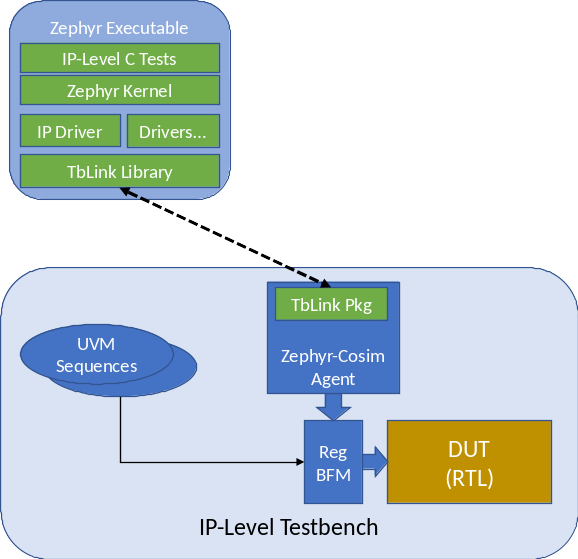

<!--

  
  

    <h1 class="post-title">
      <a href="{{ post.url | absolute_url }}">
        {{ post.title }}
      </a>
    </h1>

    {{ post.date | date_to_string }}

    {{ post.content }}
  

  

 -->

# TbLink-RPC

Functional verification testbench environments benefit from making use 
of code written in a variety of languages and integrated in a variety
of ways. For example, it's common to incorporate reference models 
written in C/C++ into a SystemVerilog UVM testbench for use by the 
scoreboard. It's often desirable to incorporate test content written 
in a language such as Python in order to leverage the expertise of
domain experts that aren't experts in SystemVerilog or UVM.

Integrating non-SystemVerilog code into a SystemVerilog environment
typically involves two key challenges. SystemVerilog provides the
Direct Procedural Interface (DPI), which enables global C functions
to be registered with the simulation and called. A custom integration
must be designed for each code module. If the code module isn't 
pure C code -- if it's Python, for example, or if it needs to
run as a separate OS process -- extra design effort will be required.
SystemVerilog UVM testbench code is object oriented, while the DPI
has no knowledge of or direct support for identifying and interacting 
with class instances. Additional design and implementation work is
required in order to interact between foreign code and  
SystemVerilog at the class object level.

The primary mission of TbLink-RPC is to enable code modules written
in multiple languages to be easily and seamlessly integrated into
testbench environments with a minimum of effort and maximum reuse. TbLink
employes a combination of environment-specific libraries and automated
code generation to allows object-oriented languages to interact at the 
class object level.

# Use-Case Examples

## Implementing a UVM Sequence in Python

UVM virtual sequences are typically written at the application level,
and may exercise the design using reference data. Python excels at
capturing this type of software-level test behavior. It also has easy
access to libraries for loading, creating, and manipulating reference
data. 

In this usecase, the desired behavior is as follows:
- UVM Testbench creates and launches a UVM virtual sequence
- An instance of a Python class is created to implement the body
  of the virtual sequence. When the UVM testbench environment calls 
  the 'body' method of the sequence, the Python 'body' method is
  invoked.
- The 'body' method in the Python class calls Python methods as
  well as methods implemented by the SystemVerilog class to implement
  the required test behavior.

## Integrating the Zephyr RTOS as Software Behavior

The [Zephyr RTOS](https://www.zephyrproject.org) provides support 
for host-compiling the OS, drivers, and application. The resulting
executable can be used to support application development. It can
also be used to co-simulate software behavior with a UVM testbench
environment.

In this usecase, TbLink simplifies the integration process by:
- Providing a C++ API that can be used from the Zephyr executable
  to call into the UVM testbench environment
- Providing built-in support for launching an external process
  and communicating over a socket
- Providing UVM-specific infrastructure to simplify the 
  management of the external process.

## TbLink-RPC Project

TbLink-RPC is not yet in a suitable state for end users, but is in 
active development. If you're interested, please see projects in the 
[tblink-rpc](https://github.com/tblink-rpc) organization. Here is a
short overview of key projects.

- [tblink-rpc-core](https://github.com/tblink-rpc/tblink-rpc-core) -- Core API implementations in C++ and Python
- [tblink-rpc-hdl](https://github.com/tblink-rpc/tblink-rpc-hdl) -- HDL-Simulator integrations for Verilog and SystemVerilog simulators
- [pytblink-rpc](https://github.com/tblink-rpc/pytblink-rpc) -- Python-based user facade 

<!--

  
    <a class="pagination-item older" href="{{ paginator.next_page_path | absolute_url }}">Older</a>
  
    Older
  
  
    
      <a class="pagination-item newer" href="{{ '/' | absolute_url }}">Newer</a>
    
      <a class="pagination-item newer" href="{{ paginator.previous_page_path | absolute_url }}">Newer</a>
    
  
    Newer
  

  -->

